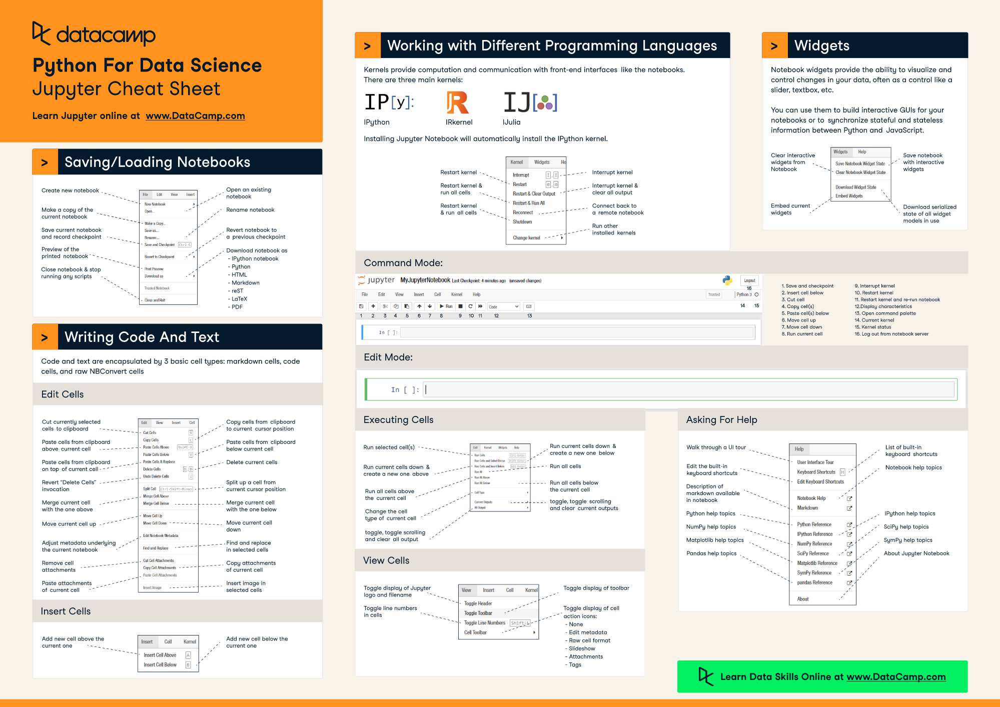

# Jupyter Notebook

Jupyter Notebook is an open-source web application that allows you to create and share documents that contain live code, equations, visualizations and narrative text. It is used for data cleaning and transformation, numerical simulation, statistical modeling, data visualization, machine learning, and much more.

## Keyboard shortcuts

### Command Mode (press `Esc` to enable)

|Command|Description|
|:-:|:-:|
|`F`|find and replace|
|`Ctrl-Shift-F`|open the command palette|
|`Ctrl-Shift-P`|open the command palette|
|`Enter`|enter edit mode|
|`P`|open the command palette|
|`Shift-Enter`|run cell, select below|
|`Ctrl-Enter`|run selected cells|
|`Alt-Enter`|run cell and insert below|
|`Y`|change cell to code|
|`M`|change cell to markdown|
|`R`|change cell to raw|
|`1`|change cell to heading 1|
|`2`|change cell to heading 2|
|`3`|change cell to heading 3|
|`4`|change cell to heading 4|
|`5`|change cell to heading 5|
|`6`|change cell to heading 6|
|`K`|select cell above|
|`Up`|select cell above|
|`Down`|select cell below|
|`J`|select cell below|
|`Shift-K`|extend selected cells above|
|`Shift-Up`|extend selected cells above|
|`Shift-Down`|extend selected cells below|
|`Shift-J`|extend selected cells below|
|`Ctrl-A`|select all cells|
|`A`|insert cell above|
|`B`|insert cell below|
|`X`|cut selected cells|
|`C`|copy selected cells|
|`Shift-V`|paste cells above|
|`V`|paste cells below|
|`Z`|undo cell deletion|
|`D`, `D`|delete selected cells|
|`Shift-M`|merge selected cells, or current cell with cell below if only one cell is selected|
|`Ctrl-S`|Save and Checkpoint|
|`S`|Save and Checkpoint|
|`L`|toggle line numbers|
|`0`|toggle output of selected cells|
|`Shift-0`|toggle output scrolling of selected cells|
|`H`|show keyboard shortcuts|
|`I`, `I`|interrupt the kernel|
|`0`, `0`|restart the kernel (with dialog)|
|`Esc`|close the pager|
|`Q`|close the pager|
|`Shift-L`|toggles line numbers in all cells, and persist the setting|
|`Shift-Space`|scroll notebook up|
|`Space`|scroll notebook down|

### Edit Mode (press `Enter` to enable)

